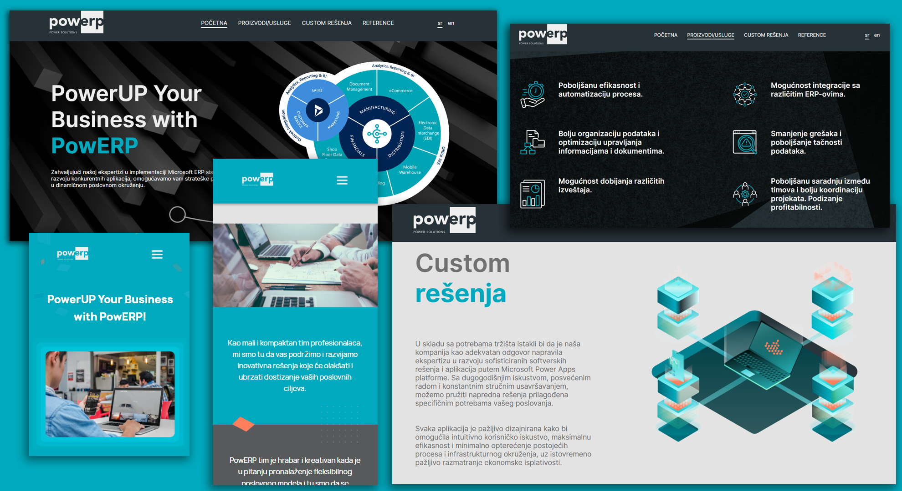

# PowERP Official Website - Static Website

> Static website built with the HTML & CSS & JavaScript.

This is a website that was made for PowERP client. The website was made purely with HTML & CSS & JavaScript. It contains couple of pages and it is fully responsive. The website itself has informational purpose so it doesn't require much features. However, with the help of JavaScript the website has modern animations and each page can be read in both Serbian and English.

<!-- toc -->

- [Features](#features)
- [Usage](#usage)

<!-- tocstop -->

## Features

- Topbar with basic navigation to each section
- Static info separated within several sections
- Modern design
- Ability to change languages
- Ability to submit a form
- Modern animations
- Responsive design

## Usage

- Install Live Server extension
- Start the Live Server

---
